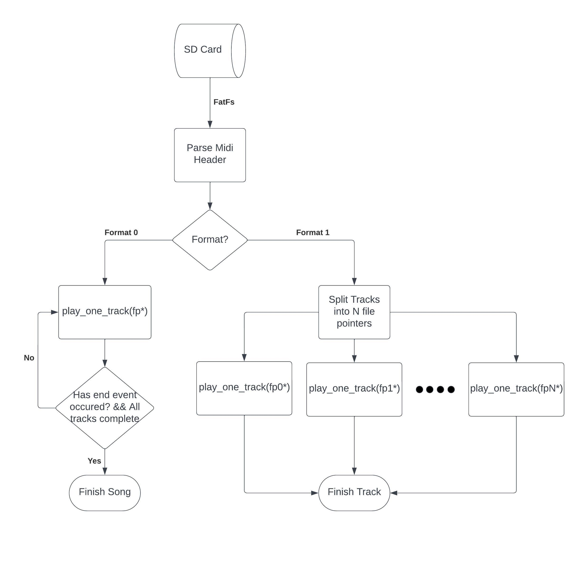

# Midi Parse Thread

## Synopsis
The song which is desired to play would be added to an sd card and using the FatFs peripheral would be converted into a file pointer. Then the file is parsed to verify it is a MIDI file and begins to step through the events within. These events being Meta events, Midi events, and Sysex events and will be described in more detail in a later section. As these events progress notes are added to a FreeRTOS queue with the frequency and duration of the notes so that a secondard thread which would be found [here](link) would propagate the PWM signal and play the necessary note.

## System Diagram 

## FatFS

First the song will be stored on an SD Card and as the STM I chose to utilize (Nucleo F44RE) does have an built in sd card port I will be using this [module](https://01001000.xyz/2020-08-09-Tutorial-STM32CubeIDE-SD-card/) to setup and initialize the system.

## MIDI Background and Parsing
After the file pointer is created the file is now able to be read we can begin to move through the MIDI header and extract neccessary info for playback, in this case we first verify the file we are parsing is a MIDI file and get the format, number of tracks, and the division. More specifics about the MIDI headerchunks can be found [here] (https://ccrma.stanford.edu/~craig/14q/midifile/MidiFileFormat.html).

For our system the most first value we need to take note of is the format which have the types as follows:
* Format 0 = Single song and tracks play in order
* Format 1 = Single song and tracks play concurrently 
* Format 2 = Multiple songs (Currently unsupported)

Each format would require unique playback and setup and in the case of the tesla coil array would change the number of coils to be utilized based on this information which can be seen in the system diagram above. 

## play_one_track

