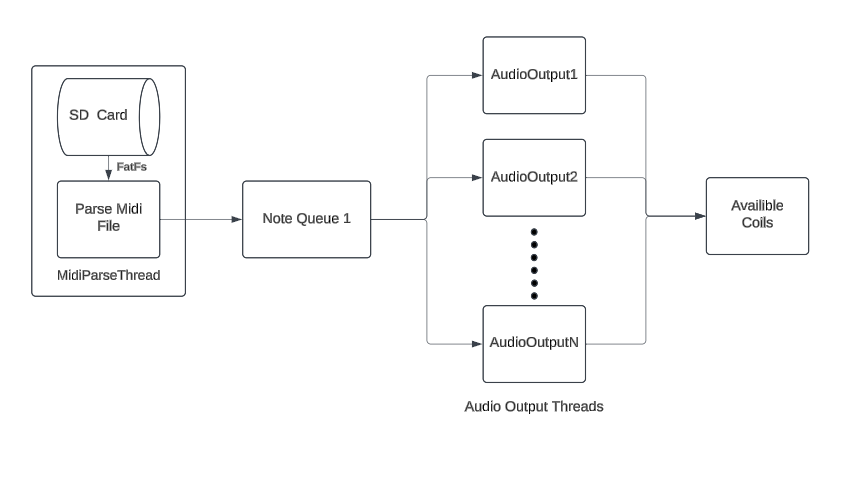

# SingingTeslaCoil

## Abstract 

A [bluetooth controlled tesla coil](https://www.amazon.com/Joytech-Bluetooth-Loudspeaker-Transmission-Experiment/dp/B08KDG6CFK/ref=sr_1_1?dib=eyJ2IjoiMSJ9.jcJKfVIxfNRr2NYpISjmYrbMUUJ3lBEZphMIlKq8sg6zjZEekDJb9W24SPRy5rwD8pWmO0Qw2kqsUxoXW3BbQ604sA6yZjjdyAPkIhQYs-folgYbeQcCFXR0aduB3LFU8Lyu0xs-FqMQB9cuBs8yC1oDPR6SXmdb0cqRl93jRVKuO8ZMPxTWok0gZpAM6pvj0Gbqf_QJNVKl38TiKO_3N8x9LfDNSLLnbwStXQUxuzE.3JayxM7fZaikcn5mz6IQdINlx1W8vY8ROc_Jz39axT8&dib_tag=se&keywords=singing%2Btesla%2Bcoil&qid=1729105038&sr=8-1) was purchased off of amazon and reverse engineered with a tedious plan id-ing chips and understanding how the system functions overall a more detailed explaination can be found [here]() but the takeaway is that based on how the device is set up we can trigger a comparator to generate the control signal to the necessary MOSFETS to charge and discharge the coil to play notes and songs.

This system would require to be broken down the parts as it requires concurrent playing of different notes to create chords and play more complex music. This would mean that there are hardware requirements so that the quality and complexity of sucessful music playing would heavily depend on the number of coils availible as they would only be able to play a single note at a time. Up to 13 coils are supported however this is a bit excessive and most songs can play with just a few.

##Introdution:
This is my first project using FreeRTOS and the STM32F44RE dev-board so I am to pratcice those skills in a soft real-time enviroment such as audio playback I used and developed the following skills while I was making this project and they are listed below. 

Skills:
* FreeRTOS (ensures playback timings and minimizes CPU downtime)
* FATFS (storage of song)
* STM32F44RE (industry microcontroller)
* C

## High Level System Diagram

Note: Current implimentation supports up to 16 timers and coils but could vary based on STM SOC used. Specifics on thread implimentation can be found in the links below:

[MidiParseThread](Documentation/MidiParseThread.md)

[AudioOutputThread](Documentation/AudioOutputThread.md)

## [MIDI Header](https://ccrma.stanford.edu/~craig/14q/midifile/MidiFileFormat.html)
The first step of this process would be to begin by removing all necessary info from the MIDI file header. More detailed information about the header can be found in the hyperlink on the title. For this system specifically however, the most important pieces of info would be the format and number of tracks as well as the division (units per beat).

The formats are as follows:

Format 0 -> A single track

Format 1 -> Multiple tracks format (to be played concurrently)

Format 2 -> Multiple song format (not supported and very uncommon)

## Known Issues
The system does lose information from the original file played due to hardware limitations, however, it still sucessfully allow for all notes to be played with their proper frequency and timings. The timbre of the sound is not able to be adjusted as it is not a proper audio signal so songs that require specific instruments or contain multiple instruments that would be layered on one another would be unable to have their difference heard between eachother and would sort of just meld together.

## Conclusion
This was a very interesting and very enjoyable project to complete I had a few bugs of note which will all be described below:

The first large bug I had was an issue with the FATFS system I went through the driver I had found step by step a few times at first to verify everything was set up correctly then I went into the common bugs for the driver and I found a large amount of people all saying different things so nautrally I tried each one until I eventully started checking my hardware and lo and behold I purchased a set of bad modules so I learned quite a bit more about the low level characteristics of how SD cards work than intended which is by no means a bad thing.

The second largest struggle I had was an incosistent bug which would occur at different points each run of the program it would occur when a bad delay value would be attatched to the parsed note the part that was strange was that it was only the delay that would be effected so after checking the delay calculation I began to belive it was a race condition somewhere as it is a multithreaded system however, the FreeRTOS Queues are thread safe so this was not the issue so I had eventually decided to increase the stack size of the queue a little which fixed the issue and made sure to have more waiting for the other tasks to tick so that more of the memory would be freed as notes are played.

I did not realize the depth at which audio processing and audio applications function so I will proceed to move into another project which I discuss below which would go more in depth into audio processing and would involve more custom hardware creation/PCB Design so I would be able to build my system cradle to grave to make it work well with exactly the right type of characteristics.

## Future Works
[Digital Signal Processing Library](https://github.com/ThaneGallo/DSP_custom)
* FFT, filters, distortion, clipping ETC
* Created specifically for audio applications 

Custom Guitar Pedal
* will include above libary to be reprogrammable and allow for layered effects 

