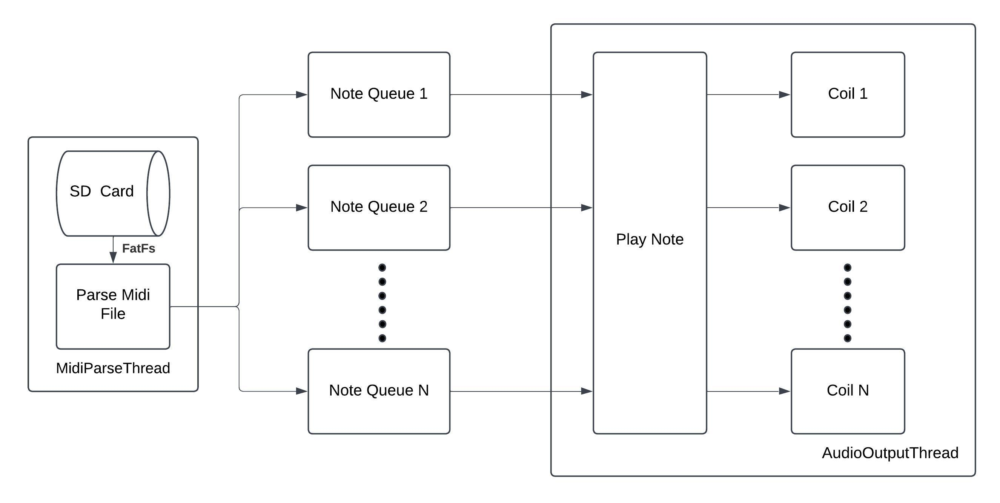

# SingingTeslaCoil

## Abstract 

A [bluetooth controlled tesla coil](https://www.amazon.com/Joytech-Bluetooth-Loudspeaker-Transmission-Experiment/dp/B08KDG6CFK/ref=sr_1_1?dib=eyJ2IjoiMSJ9.jcJKfVIxfNRr2NYpISjmYrbMUUJ3lBEZphMIlKq8sg6zjZEekDJb9W24SPRy5rwD8pWmO0Qw2kqsUxoXW3BbQ604sA6yZjjdyAPkIhQYs-folgYbeQcCFXR0aduB3LFU8Lyu0xs-FqMQB9cuBs8yC1oDPR6SXmdb0cqRl93jRVKuO8ZMPxTWok0gZpAM6pvj0Gbqf_QJNVKl38TiKO_3N8x9LfDNSLLnbwStXQUxuzE.3JayxM7fZaikcn5mz6IQdINlx1W8vY8ROc_Jz39axT8&dib_tag=se&keywords=singing%2Btesla%2Bcoil&qid=1729105038&sr=8-1) was purchased off of amazon and the bluetooth chip was removed as well as the hardwired controller chip. 

Next, a STM32 nucleo development board was used to replace this chip using custom firmware to generate PWMs for the notes within the MIDI file for the hard real-time system to  allow for a custom controls. 

As it is a hard real time system we would need to break down the parts of it into different threads to make sure all pieces happen with the correct timings to make sure the notes play correctly and the desired output is obtained.

## High Level System Diagram

Note: Current implimentation supports up to 16 timers and coils but could vary based on STM SOC used. Specifics on thread implimentation can be found in the links below:

[ParseMidiThread](Documentation/ParseMidiThread.md)

[AudioOutputThread](Documentation/AudioOutputhread.md)

## [MIDI Header](https://ccrma.stanford.edu/~craig/14q/midifile/MidiFileFormat.html)
The first step of this process would be to begin by removing all necessary info from the MIDI file header. More detailed information about the header can be found in the hyperlink on the title. For this system specifically however, the most important pieces of info would be the format and number of tracks as well as the division (units per beat).

The formats are as follows:

Format 0 -> A single track

Format 1 -> Multiple tracks format (to be played concurrently)

Format 2 -> Multiple song format

## System Diagram 

